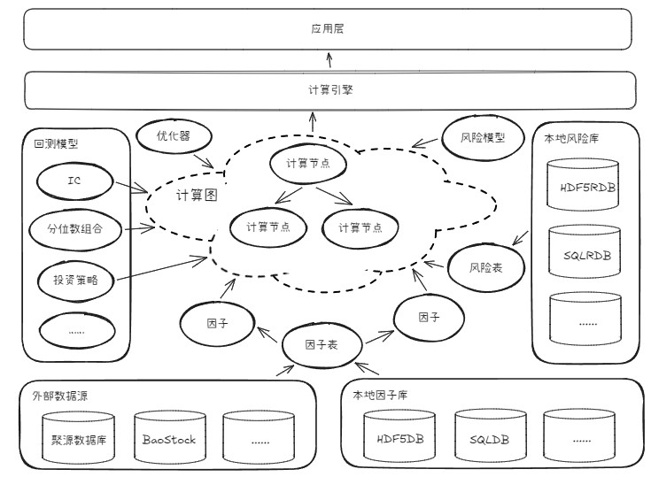

```python
from IPython.display import Markdown

from QuantStudio.Tools.Visualization import qs_help
```

# QuantStudio 对象

所有的 QuantStudio 对象均继承自 `QuantStudio.Core.__QS_Object__`。

可以通过 `qs_help` 函数获取 QuantStudio 中对象的帮助信息。


```python
from QuantStudio.Core import __QS_Object__
print(qs_help(__QS_Object__))
```

    类型: class
    模块: QuantStudio.Core
    构造函数签名: __QS_Object__.__init__(self, args: dict = {}, config_file: Optional[str] = None, **kwargs)
    构造函数文档:
        实例化 QuantStudio 系统对象
        
        Args:
            args: 指定的对象参数集
            config_file: 配置文件路径, 配置文件用于设置对象参数。配置文件是一个 json 格式的文件(字符编码为 utf-8, 扩展名为 json), 以键值对的形式给出各个参数的取值
            kwargs:
                logger: 日志对象, 用于打印内部日志, 如果没有指定则使用默认的 QuantStudio.Core.__QS_Logger__ 对象
    说明文档:
        Quant Studio 系统对象


QuantStudio 对象配置文件的默认存放位置为用户目录下的 “QuantStudioConfig” 文件夹:
* Windows 系统下通常为 “C:\Users\你的用户名\QuantStudioConfig”, 
* Linux 系统下通常为 “/home/你的用户名/QuantStudioConfig”, 
* Mac OS 下通常为 “/Users/你的用户名/QuantStudioConfig”

或者可以运行下面的代码获取该路径:


```python
from QuantStudio import __QS_ConfigPath__
print(__QS_ConfigPath__)
```

    C:\Users\hst\QuantStudioConfig


QuantStudio 对象有三个基本属性：QSID, Args, Logger


```python
print("QSID", qs_help(__QS_Object__.QSID), sep="\n")
print("-"*10)
print("Args", qs_help(__QS_Object__.Args), sep="\n")
print("-"*10)
print("Logger", qs_help(__QS_Object__.Logger), sep="\n")
```

    QSID
    类型: property
    说明文档:
        表示对象行为的全局唯一 id, 且每次运行程序时该 id 不变。相同 QSID 的对象行为一致，但不同的 QuantStudio 对象有可能 QSID 相同
    ----------
    Args
    类型: property
    说明文档:
        参数集对象
    ----------
    Logger
    类型: property
    说明文档:
        日志对象


```python
# QuantStudio 对象基本属性, 以 HDF5DB 为例
from QuantStudio.Factor.HDF5DB import HDF5DB

HDB = HDF5DB(args={"MainDir": "./data/HDF5"})
print("QSID : ", HDB.QSID)
print("Args : ", HDB.Args)
print("Logger : ", HDB.Logger)
```

    QSID :  c10190f1688a6555a5fb5095e203e79f7d541993cfb7e210a22bfd7dea986e8a
    Args :  HDF5DB.Args(Name='HDF5DB', MainDir=WindowsPath('data/HDF5'), LockDir=None, FileOpenRetryNum=inf, ProcessLock=True)
    Logger :  <Logger QS (INFO)>


QuantStudio 对象有一个基本方法：`new`


```python
print(qs_help(__QS_Object__.new))
```

    类型: function
    模块: QuantStudio.Core
    签名: __QS_Object__.new(self, args: dict = {}, **kwargs) -> '__QS_Object__'
    说明文档:
        给定新的参数集 args 创建一个新的 QuantStudio 对象, args 中未指定的参数则使用原对象的参数
        
        Args:
            args: 指定的新参数集
            kwargs: 创建 QuantStudio 对象需要的其他入参
        
        Returns:
            QuantStudio 对象


```python
NewFDB = HDB.new(args={"Name": "NewHDF5DB"})
print("QSID : ", NewFDB.QSID)
print("Args : ", NewFDB.Args)
print("Logger : ", NewFDB.Logger)
```

    QSID :  ef6f6d9ee9ca2e8139ef94dff63b40278f88d0547f9cd89efa3acc866138f0c6
    Args :  HDF5DB.Args(Name='NewHDF5DB', MainDir=WindowsPath('data/HDF5'), LockDir=None, FileOpenRetryNum=inf, ProcessLock=True)
    Logger :  <Logger QS (INFO)>


# 参数集对象
所有的 QuantStudio 对象均有一个参数集对象的属性 Args，参数集类似于一个 dict，某些参数决定了 QuantStudio 对象的行为。

所有的参数集对象均继承自 `QuantStudio.Core.__QS_Args__`, 参数集有三个基本属性：
* QSID: str, 表示参数集的全局唯一 id，且每次运行程序时该 id 不变。
* Logger: 日志对象
* Owner: 参数集所属的 QuantStudio 对象，如果为 None 表示该参数集不属于任何 QuantStudio 对象

参数集对象实现了如下方法：
* `__iter__`: 用于迭代参数
* `__getitem__`: 给定参数名称, 获取参数值
* `__setitem__`: 设置参数


```python
# 参数获取和修改
print("修改前: ")
for iArgName, iArgVal in HDB.Args:
    print(iArgName, ": ", iArgVal)
print("=============================")

HDB.Args["FileOpenRetryNum"] = 3

print("修改后: ")
for iArgName, iArgVal in HDB.Args:
    print(iArgName, ": ", iArgVal)
```

    修改前: 
    Owner :  <QuantStudio.Factor.HDF5DB.HDF5DB object at 0x000002A2470BC410>
    Logger :  <Logger QS (INFO)>
    Name :  HDF5DB
    MainDir :  data\HDF5
    LockDir :  None
    FileOpenRetryNum :  inf
    ProcessLock :  True
    =============================
    修改后: 
    Owner :  <QuantStudio.Factor.HDF5DB.HDF5DB object at 0x000002A2470BC410>
    Logger :  <Logger QS (INFO)>
    Name :  HDF5DB
    MainDir :  data\HDF5
    LockDir :  None
    FileOpenRetryNum :  3
    ProcessLock :  True


参数集对象有如下基本方法：`to_dict`, `meta`, `info`


```python
from QuantStudio.Core import __QS_Args__

print(qs_help(__QS_Args__.to_dict))
```

    类型: function
    模块: QuantStudio.Core
    签名: __QS_Args__.to_dict(self, repr: bool = True) -> dict
    说明文档:
        以 dict 形式返回所有参数和参数值
        
        Args:
            repr: 是否仅返回可见参数
        
        Returns:
            {参数名: 参数值}


```python
print(qs_help(__QS_Args__.meta))
```

    类型: function
    模块: QuantStudio.Core
    签名: __QS_Args__.meta(self, key: Optional[Literal['annotation', 'title', 'description', 'default', 'required', 'frozen', 'exclude', 'repr']] = None, repr: bool = True) -> Union[pandas.core.series.Series, pandas.core.frame.DataFrame]
    说明文档:
        返回参数集中参数的元信息, 元信息由若干个键值对组成
        
        Args:
            key: 元信息键, None 表示获取所有的元信息, key 可选下列值
                - annotation: str, 参数值的数据类型
                - title: str, 参数的说明性名称
                - description: str, 参数的描述信息
                - frozen: bool, 参数值初始化后是否不能再修改, 默认值 False
                - exclude: bool, False 表示用于生成参数集的 QSID, 即该参数会影响对象的行为, 默认值 False
                - repr: bool, 该参数是否可见, 默认值 True
            repr: 是否仅返回可见参数
        
        Returns:
            如果 key=None, 则返回 DataFrame(index=[参数名], columns=[所有的 key])
            如果 key 非 None 则返回该 key 对应的元信息, Series(index=[参数名])


```python
print(qs_help(__QS_Args__.info))
```

    类型: function
    模块: QuantStudio.Core
    签名: __QS_Args__.info(self, repr: bool = True, html: bool = False) -> str
    说明文档:
        返回参数集中参数的说明信息
        
        Args:
            repr: 是否仅返回可见参数
            html: 是否返回 HTML 格式的说明, False 返回 Markdown 格式的说明
        
        Returns:
            `参数: 数据类型, 默认值, 描述信息` 格式的列表


```python
# 参数信息
from IPython.display import HTML

print(HDB.Args.to_dict())
print("-" * 10)
print(HDB.Args.meta(key="frozen"))
print("-" * 10)
display(Markdown(HDB.Args.info(html=False)))
```

    {'Name': 'HDF5DB', 'MainDir': WindowsPath('data/HDF5'), 'LockDir': None, 'FileOpenRetryNum': 3, 'ProcessLock': True}
    ----------
    Name                 True
    MainDir              True
    LockDir              True
    FileOpenRetryNum    False
    ProcessLock          True
    dtype: object
    ----------


* Name(名称): <class 'str'>, 默认值 HDF5DB, 当前取值: 'HDF5DB'
* MainDir(主目录): <class 'pathlib.Path'>, 无默认值, 存放数据的主目录, 当前取值: data\HDF5
* LockDir(锁目录): typing.Optional[typing.Annotated[pathlib.Path, PathType(path_type='dir')]], 默认值 None, 存放锁文件的目录, 默认 None 表示和主目录相同, 当前取值: None
* FileOpenRetryNum(文件打开重试次数): typing.Union[int, float], 默认值 inf, 打开数据文件错误时的重试次数, 当前取值: 3
* ProcessLock(进程锁): <class 'bool'>, 默认值 True, 是否添加进程锁用于防止多进程间读写冲突, 当前取值: True


<a name="ComputationGraph"></a>
# 计算图框架

QuantStudio 系统以计算图为核心, 系统中主要的计算以有向图的形式表达，图由若干个节点组成，每个节点完成某种定义的计算，节点之间的依赖关系以有向边来表示，边从依赖节点指向被依赖的节点。计算引擎负责调度和执行计算图。



每个计算节点必须继承自 `QuantStudio.Core.Node.Node`，对象创建的 `__init__` 方法除了 QuantStudio 对象的三个输入参数外还有一个 deps 参数，其为当前节点依赖的节点列表。

要实现一个计算节点，必须实现 Node 的五个方法: `init_compute`, `prepare_compute`, `forward_compute`, `backward_compute`, `merge_result`, 其中除 `backward_compute` 外均有默认实现，`backward_compute` 是节点运算的主逻辑实现。


```python
from QuantStudio.Core.Node import Node
print(qs_help(Node.init_compute))
print("-" * 10)
print(qs_help(Node.prepare_compute))
print("-" * 10)
print(qs_help(Node.forward_compute))
print("-" * 10)
print(qs_help(Node.backward_compute))
print("-" * 10)
print(qs_help(Node.merge_result))
```

    类型: function
    模块: QuantStudio.Core.Node
    签名: Node.init_compute(self, path: List[str], init_data: Any, context: QuantStudio.Core.Node.Context) -> List[Any]
    说明文档:
        按照边的方向传递数据执行初始化，可以修改 context 中的全局变量，最好不要有耗时的计算
        
        Args:
            path: 运行至当前节点的路径, 所有上游节点 ID 的 list
            init_data: 上游传递的数据
            context: 全局上下文对象
        
        Returns:
            产生的向下游传递的数据列表, 如果返回空 list 表示终止继续向下的初始化
    ----------
    类型: function
    模块: QuantStudio.Core.Node
    签名: Node.prepare_compute(self, prepare_data: Any, context: QuantStudio.Core.Node.Context)
    说明文档:
        主逻辑计算开始前的准备计算, 不可以修改 context 中的全局变量，最好将 IO 操作在这里实现，只对 context.PrepareNodeDict 中的节点执行该操作
        
        Args:
            prepare_data: 执行准备计算所需的数据, 在 init_compute 时生成在 context.PrepareNodeDict 中
            context: 全局上下文对象
    ----------
    类型: function
    模块: QuantStudio.Core.Node
    签名: Node.forward_compute(self, path: List[str], fwd_data: Any, context: QuantStudio.Core.Node.Context) -> Tuple[List[Any], Any]
    说明文档:
        按照边的方向传递数据执行运算, 即从依赖节点向被依赖节点传递
        
        Args:
            path: 运行至当前节点的路径, 所有上游节点 ID 的 list
            fwd_data: 上游传递的数据
            context: 运算时全局上下文对象
        
        Returns: 
            (产生的向下游传递的数据列表, 局部运行时上下文), 如果返回空数据列表表示终止继续向下的运算, 局部运行时上下文将传递给 backward_compute 方法作为入参
    ----------
    类型: function
    模块: QuantStudio.Core.Node
    签名: Node.backward_compute(self, path: List[str], bwd_data_list: List[Any], context: QuantStudio.Core.Node.Context, local_context: Any = None) -> Any
    说明文档:
        按照边的反方向传递数据执行运算, 即从被依赖节点向依赖节点传递
        
        Args:
            path: 运行至当前节点的路径, 所有上游节点 ID 的 list
            bwd_data_list: 下游传递的数据列表, 如果为空列表表示在 forward_compute 方法中选择了终止向下的运算
            context: 运算时全局上下文对象
            local_context: 运算时局部上下文对象
        
        Returns:
            计算后产生的结果
    ----------
    类型: function
    模块: QuantStudio.Core.Node
    签名: Node.merge_result(self, result_list: List[Any], context: QuantStudio.Core.Node.Context) -> Any
    说明文档:
        合并并行计算产生的结果
        
        Args:
            result_list: 并行计算产生的结果列表
            context: 运算时全局上下文对象
        
        Returns:
            合并后的结果


节点计算方法的入参里有一个全局上下文对象 Context，其继承自 `__QS_Args__`，主要用于维护全局信息以及节点的运行时状态，其字段如下：


```python
from QuantStudio.Core.Node import Context

DemoContext = Context()
display(Markdown(DemoContext.info()))
```


* Mode(运行模式): typing.Literal['PRD', 'DEBUG'], 默认值 PRD, 当前取值: 'PRD'
* NodeDict(节点集): typing.Dict[str, QuantStudio.Core.Node.Node], 默认值 {}, {节点ID: Node}, 本次运算的所有 Node, 由计算引擎生成, 当前取值: {}
* NodeState(节点状态): typing.Dict[str, typing.Any], 默认值 {}, {节点ID: Any}, 运算中用于存储节点的临时数据，由节点生成和维护, 当前取值: {}
* PrepareNodeDict(准备节点列表): typing.Dict[str, typing.Tuple[str, typing.Any]], 默认值 {}, {准备ID: (节点ID, Any)}, 需要执行准备操作的节点列表, 当前取值: {}
* PID(当前进程ID): <class 'str'>, 默认值 0, 当前的运行进程 ID, 默认为 '0', 当前取值: '0'
* PIDList(全部进程ID): typing.List[str], 默认值 ['0'], 所有运行进程 ID 列表, 当前取值: ['0']
* SplitType(切分方式): typing.Literal['连续切分', '间隔切分'], 默认值 连续切分, 当前取值: '连续切分'
* Event(同步Event): <class 'dict'>, 默认值 {}, {节点ID: (Sub2MainQueue, Event)}, 用于多进程同步的 Event 数据, 当前取值: {}
* ExtraData(其他数据): <class 'dict'>, 默认值 {}, 当前取值: {}


计算图的调度和运行由计算引擎对象 Engine 执行，每种计算引擎的实现均继承自 `QuantStudio.Core.CalcEngine.Engine`，其执行计算的主要方法是 `run`


```python
from QuantStudio.Core.CalcEngine import Engine

print(qs_help(Engine.run))
```

    类型: function
    模块: QuantStudio.Core.CalcEngine
    签名: Engine.run(self, node_list: List[QuantStudio.Core.Node.Node], context: QuantStudio.Core.Node.Context, init_data_list: Optional[List[Any]] = None, fwd_data_list: Optional[List[Any]] = None) -> List[Any]
    说明文档:
        给定节点列表, 执行所有节点的计算, 返回每个节点的计算结果
        
        Args:
            node_list: 待计算的节点列表
            context: 全局上下文对象
            init_data_list: 初始化数据列表
            fwd_data_list: 前向计算输入数据列表
        
        Returns:
            节点计算的结果列表


```python
# 使用计算图框架实现四则运算
from typing import Any, List, Optional

import numpy as np
import pandas as pd

from QuantStudio.Core.Node import Node, Context
from QuantStudio.Core.CalcEngine import Engine

class Num(Node):
    """数字"""
    def __init__(self, value:float, deps:List["Node"]=[], args:dict={}, config_file:Optional[str]=None, **kwargs):
        if "Name" not in args: args = args | {"Name": str(value)}
        self._Value = value
        return super().__init__(deps=deps, args=args, config_file=config_file, **kwargs)

    def backward_compute(self, path: List[str], bwd_data_list: List[Any], context: Context, local_context:Any=None) -> Any:
        return self._Value

class Sum(Node):
    """加法"""
    def __init__(self, deps:List["Node"]=[], args:dict={}, config_file:Optional[str]=None, **kwargs):
        return super().__init__(deps=deps, args={"Name": "sum"} | args, config_file=config_file, **kwargs)
    
    def backward_compute(self, path: List[str], bwd_data_list: List[Any], context: Context, local_context:Any=None) -> Any:
        return np.sum(bwd_data_list)

class Sub(Node):
    """减法"""
    def __init__(self, deps:List["Node"]=[], args:dict={}, config_file:Optional[str]=None, **kwargs):
        return super().__init__(deps=deps, args={"Name": "sub"} | args, config_file=config_file, **kwargs)
    
    def backward_compute(self, path: List[str], bwd_data_list: List[Any], context: Context, local_context:Any=None) -> Any:
        return bwd_data_list[0] - bwd_data_list[1]

class Prod(Node):
    """乘法"""
    def __init__(self, deps:List["Node"]=[], args:dict={}, config_file:Optional[str]=None, **kwargs):
        return super().__init__(deps=deps, args={"Name": "prod"} | args, config_file=config_file, **kwargs)

    def backward_compute(self, path: List[str], bwd_data_list: List[Any], context: Context, local_context:Any=None) -> Any:
        return np.prod(bwd_data_list)

class Div(Node):
    """除法"""
    def __init__(self, deps:List["Node"]=[], args:dict={}, config_file:Optional[str]=None, **kwargs):
        return super().__init__(deps=deps, args={"Name": "div"} | args, config_file=config_file, **kwargs)
    
    def backward_compute(self, path: List[str], bwd_data_list: List[Any], context: Context, local_context:Any=None) -> Any:
        return bwd_data_list[0] / bwd_data_list[1]


Node1 = Prod([Sum([Num(1), Num(2)]), Num(3)], args={"Name": "(1 + 2) * 3"})
Node2 = Sum([Num(3), Prod([Num(3), Num(2)])], args={"Name": "3 + 3 * 2"})

Engine = Engine()
NodeList = [Node1, Node2]
Rslt = Engine.run(NodeList, Context())
for i, iNode in enumerate(NodeList):
    print(iNode.Name, "=", Rslt[i])
```

    2026-03-20 22:07:01,939 | QS | INFO : 开始初始化计算...
    2026-03-20 22:07:01,940 | QS | INFO : 初始化计算完成, 耗时 0.0005095000087749213 秒
    2026-03-20 22:07:01,941 | QS | INFO : 开始准备计算...
    2026-03-20 22:07:01,941 | QS | INFO : 准备计算完成, 耗时 2.700020559132099e-06 秒
    2026-03-20 22:07:01,941 | QS | INFO : 开始正式计算...
    2026-03-20 22:07:01,942 | QS | INFO : 正式计算完成, 耗时 0.00010559998918324709 秒


    (1 + 2) * 3 = 9
    3 + 3 * 2 = 9


```python
# %pip install mermaid-python
```


```python
# 计算图的可视化
from mermaid import Mermaid
from QuantStudio.Tools.Visualization import node2dict, dict2mermaid

NodeDict = node2dict([Node1, Node2])
NodeMermaid = dict2mermaid(NodeDict)
display(Mermaid(NodeMermaid))
```


<div class="mermaid-d0e4877f-9d02-409d-aeff-9df268c8651d"></div>
<script type="module">
    import mermaid from 'https://cdn.jsdelivr.net/npm/mermaid@10.1.0/+esm'
    const graphDefinition = 'graph TD\n    node1["(1 + 2) * 3"]\n    node2["sum"]\n    node1 --> node2\n    node3["1"]\n    node2 --> node3\n    node4["2"]\n    node2 --> node4\n    node5["3"]\n    node1 --> node5\n    node6["3 + 3 * 2"]\n    node6 --> node5\n    node7["prod"]\n    node6 --> node7\n    node7 --> node5\n    node7 --> node4';
    const element = document.querySelector('.mermaid-d0e4877f-9d02-409d-aeff-9df268c8651d');
    const { svg } = await mermaid.render('graphDiv-d0e4877f-9d02-409d-aeff-9df268c8651d', graphDefinition);
    element.innerHTML = svg;
</script>


