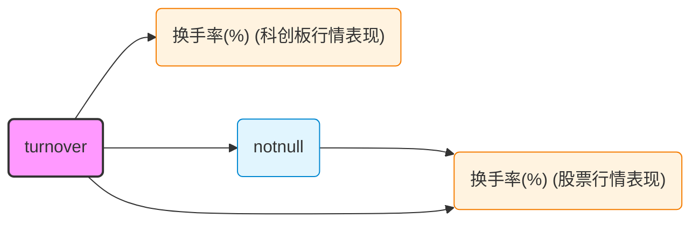

# FactorRegistry — 因子注册中心

## 1. 背景与动机

QuantStudio 的因子系统以计算图（DAG）为核心：每个 `Factor` 是图中的节点，`Node.Deps` 记录其依赖关系。但这一依赖图仅存在于运行时内存中，无持久化存储，导致以下问题：

- **无法跨会话复用**：因子随进程结束而丢失，每次需重新构建
- **缺乏因子目录**：无法按名称、算子类型、标签等条件检索已有因子
- **依赖关系不可追溯**：无法回答"哪些因子依赖于 Close 价格"之类的拓扑查询
- **影响分析困难**：修改一个底层因子时，无法快速确定受影响的下游因子

本方案建立 `QuantStudio.FactorRegistry` 模块作为**因子注册中心**，当前版本以 Neo4j 图数据库为存储引擎，实现因子的存储、检索、重建计算和依赖分析。未来可扩展为因子生命周期管理、版本控制、共享协作等能力的统一入口。

---

## 2. 模块结构

```
QuantStudio/FactorRegistry/
├── __init__.py              # 包初始化，模块级日志
├── api.py                   # 对外 API 导出
├── FactorGraphDB.py         # Neo4j 图数据库实现（主文件）
├── _serialization.py        # 序列化/反序列化辅助函数
└── mcp_server.py            # MCP Server（3 个工具，stdio 模式）
```

### `api.py` 导出内容

```python
from .FactorGraphDB import FactorGraphDB
```

### 顶层包集成

`QuantStudio/api.py` 中增加：

```python
from .FactorRegistry.api import *
```

---

## 3. 图 Schema 设计

### 3.1 节点类型

#### Factor 节点

表示一个因子实例，是图中最核心的节点类型。

| 属性 | 类型 | 说明 |
|------|------|------|
| `QSID` | string | **唯一标识**，SHA-256 内容哈希，同 QSID 的因子行为一致 |
| `Name` | string | 因子名称（人类可读，不参与 QSID 计算） |
| `ClassName` | string | Python 类名（`PointOperation`、`TimeOperation`、`DataFactor` 等） |
| `ModulePath` | string | Python 完整模块路径 |
| `FactorClass` | string | 因子类别：`DataFactor` / `DerivativeFactor` / `FactorTableFactor` |
| `DataType` | string | 输出数据类型：`double` / `string` / `object` |
| `OperatorName` | string | 算子名称（仅 DerivativeFactor） |
| `OperatorType` | string | 算子类型：`Point` / `Time` / `Section` / `Panel`（仅 DerivativeFactor） |
| `OperatorQSID` | string | 算子 QSID（仅 DerivativeFactor） |
| `QSArgsJSON` | string | JSON 编码的参数集（排除 Operator 字段） |
| `MetaJSON` | string | JSON 编码的用户元信息字典 |
| `DataRef` | string | DataFactor 的数据引用（JSON） |
| `FactorTableQSID` | string | 所属因子表 QSID（仅 FactorTableFactor） |
| `FactorTableName` | string | 在因子表中的因子名称（仅 FactorTableFactor） |
| `Embedding` | List[float] | 因子描述文本的嵌入向量（由 Ollama 生成） |
| `EmbeddingModel` | string | 生成 Embedding 所使用的模型名称 |
| `EmbeddingDim` | int | 嵌入向量的维度 |
| `CreatedAt` | datetime | 创建时间 |
| `UpdatedAt` | datetime | 最后更新时间 |

**FactorClass 分类说明：**

- `DataFactor`：叶子节点，持有内联数据（标量、Series、DataFrame），无依赖
- `DerivativeFactor`：由算子作用于描述子因子计算得到，有依赖
- `FactorTableFactor`：数据来源于外部因子表（如 HDF5DB、JYDB），通过 `BELONGS_TO` 关系关联

#### FactorOperator 节点

表示一个算子实例（计算逻辑的封装）。

| 属性 | 类型 | 说明 |
|------|------|------|
| `QSID` | string | **唯一标识** |
| `Name` | string | 算子名称（如 `log`、`rolling_mean`） |
| `ClassName` | string | Python 类名（如 `Log`、`RollingApply`） |
| `ModulePath` | string | Python 完整模块路径 |
| `OperatorType` | string | `Point` / `Time` / `Section` / `Panel` |
| `Arity` | int | 输入因子数量（None 表示可变） |
| `DataType` | string | 输出数据类型 |
| `Description` | string | 人类可读描述 |
| `ModelArgsJSON` | string | JSON 编码的模型参数字典 |
| `LookBackJSON` | string | JSON 编码的回溯窗口列表（Time/Panel 类型） |
| `CalculateRef` | string | 计算函数引用（JSON），用于重建自定义算子 |
| `IsCustom` | bool | 是否为 `makeFactorOperator` 创建的自定义算子 |
| `CreatedAt` | datetime | 创建时间 |
| `UpdatedAt` | datetime | 最后更新时间 |

#### FactorTable 节点

表示一个因子表（数据集）。

| 属性 | 类型 | 说明 |
|------|------|------|
| `QSID` | string | **唯一标识** |
| `Name` | string | 因子表名称 |
| `FactorNamesJSON` | string | JSON 编码的因子名称列表 |
| `MetaDataJSON` | string | JSON 编码的表元信息 |
| `QSArgsJSON` | string | JSON 编码的 `ft._QSArgs.model_dump()`，用于跨 session 重建时保证 QSID 一致 |

#### FactorDB 节点

表示一个因子库（数据源连接）。

| 属性 | 类型 | 说明 |
|------|------|------|
| `Name` | string | **唯一标识**，因子库名称 |
| `DBType` | string | 类型标识：`HDF5` / `JYDB` / `BaoStock` 等 |
| `ClassName` | string | Python 类名 |
| `ModulePath` | string | Python 完整模块路径 |
| `ConnectionJSON` | string | JSON 编码的连接参数 |

#### Tag 节点

用户自定义的分类标签。

| 属性 | 类型 | 说明 |
|------|------|------|
| `Name` | string | **唯一标识**，标签名称 |
| `Description` | string | 标签描述 |

### 3.2 关系类型

```
Factor -[:DEPENDS_ON {order: int}]-> Factor
Factor -[:USES_OPERATOR]-> FactorOperator
Factor -[:BELONGS_TO]-> FactorTable
Factor -[:TAGGED]-> Tag
FactorTable -[:IN_DATABASE]-> FactorDB
```

| 关系 | 方向 | 属性 | 语义 |
|------|------|------|------|
| `DEPENDS_ON` | Factor → Factor | `order: int` | 因子依赖（描述子），order 为 0-based 索引，保持 descriptor 顺序 |
| `USES_OPERATOR` | Factor → FactorOperator | 无 | DerivativeFactor 使用的算子 |
| `BELONGS_TO` | Factor → FactorTable | 无 | FactorTableFactor 属于某个因子表 |
| `TAGGED` | Factor → Tag | 无 | 因子被标记了某个标签 |
| `IN_DATABASE` | FactorTable → FactorDB | 无 | 因子表属于某个因子库 |

### 3.3 约束与索引

```cypher
-- 唯一性约束
CREATE CONSTRAINT factor_qsid IF NOT EXISTS
    FOR (f:Factor) REQUIRE f.QSID IS UNIQUE;
CREATE CONSTRAINT operator_qsid IF NOT EXISTS
    FOR (o:FactorOperator) REQUIRE o.QSID IS UNIQUE;
CREATE CONSTRAINT table_qsid IF NOT EXISTS
    FOR (t:FactorTable) REQUIRE t.QSID IS UNIQUE;
CREATE CONSTRAINT fdb_name IF NOT EXISTS
    FOR (d:FactorDB) REQUIRE d.Name IS UNIQUE;
CREATE CONSTRAINT tag_name IF NOT EXISTS
    FOR (t:Tag) REQUIRE t.Name IS UNIQUE;

-- 查询索引
CREATE INDEX factor_name IF NOT EXISTS FOR (f:Factor) ON (f.Name);
CREATE INDEX factor_class IF NOT EXISTS FOR (f:Factor) ON (f.FactorClass);
CREATE INDEX factor_op_name IF NOT EXISTS FOR (f:Factor) ON (f.OperatorName);
CREATE INDEX factor_op_type IF NOT EXISTS FOR (f:Factor) ON (f.OperatorType);
CREATE INDEX operator_name IF NOT EXISTS FOR (o:FactorOperator) ON (o.Name);
CREATE INDEX operator_type IF NOT EXISTS FOR (o:FactorOperator) ON (o.OperatorType);
CREATE INDEX fdb_type IF NOT EXISTS FOR (d:FactorDB) ON (d.DBType);

-- 向量索引
CREATE VECTOR INDEX factor_embedding IF NOT EXISTS
    FOR (f:Factor) ON (f.Embedding)
    OPTIONS {indexConfig: {`vector.dimensions`: 1024, `vector.similarity_function`: 'cosine'}};
```

### 3.4 图结构示例

以一个典型的因子计算链为例：

```
ClosePrice(DataFactor) ── Log() ── PointOp("log_Close") ── Lag(5) ── TimeOp("lag5_log_Close")
```

对应的图结构：

```
(PointOp:Factor {FactorClass: "DerivativeFactor", Name: "log_Close"})
    -[:DEPENDS_ON {order: 0}]->
(ClosePrice:Factor {FactorClass: "DataFactor"})
PointOp -[:USES_OPERATOR]-> (Log:FactorOperator {Name: "log"})

(LagOp:Factor {FactorClass: "DerivativeFactor", Name: "lag5_log_Close"})
    -[:DEPENDS_ON {order: 0}]-> (PointOp)
LagOp -[:USES_OPERATOR]-> (Lag5:FactorOperator {Name: "lag", Arity: 1})
```

---

## 4. Python 类设计

### 4.1 类定义

```python
# QuantStudio/FactorRegistry/FactorGraphDB.py

try:
    import neo4j
except ImportError:
    raise ImportError("FactorGraphDB 需要 neo4j 包，请执行: pip install neo4j")

class FactorGraphDB(__QS_Object__):
    """基于 Neo4j 的因子图数据库

    因子注册中心的核心存储引擎，存储因子元数据、依赖关系图和数据引用。
    支持因子检索、重建计算、依赖分析和影响范围查询。

    参数通过 ~/QuantStudioConfig/FactorGraphDBConfig.json 配置或显式传入。
    """

    class __QS_ArgClass__(__QS_Object__.__QS_ArgClass__):
        Name: str = Field(default="FactorGraphDB", frozen=True, title="图数据库名称")
        Neo4jURI: str = Field(default="bolt://localhost:7687", frozen=True, exclude=True, title="Neo4j 连接 URI")
        Neo4jUser: str = Field(default="neo4j", frozen=True, exclude=True, title="Neo4j 用户名")
        Neo4jPwd: str = Field(default="", frozen=True, exclude=True, repr=False, title="Neo4j 密码")
        Neo4jDB: str = Field(default="neo4j", frozen=True, exclude=True, title="Neo4j 数据库名")
        OllamaBaseURL: str = Field(default="http://127.0.0.1:11434", frozen=True, exclude=True, title="Ollama 服务地址")
        OllamaAPIKey: str = Field(default="ollama", frozen=True, exclude=True, repr=False, title="Ollama API Key")
        EmbeddingModel: str = Field(default="", frozen=True, exclude=True, title="嵌入模型名，空字符串表示禁用")
        EmbeddingDim: int = Field(default=0, frozen=True, exclude=True, title="预期嵌入维度，0=自动检测")
        DataDir: Optional[str] = Field(default=None, frozen=True, exclude=True, title="数据因子内联数据存储目录")

    def __init__(self, args={}, config_file=None, **kwargs):
        super().__init__(args=args, config_file=config_file, **kwargs)
        self._Driver = None
        self._FactorDBRegistry: Dict[str, "FactorDB"] = {}
        if self._QSArgs.DataDir is None:
            self._QSArgs.DataDir = os.path.join(tempfile.gettempdir(), "QS_FactorGraphDB_Data")
```

**设计要点：**

- 继承 `__QS_Object__`（非 `FactorDB`），因为本类存储的是图元数据而非因子数据
- 遵循框架的配置优先级：显式参数 > JSON 配置文件 > 默认值
- `DataDir` 用于 DataFactor 的内联数据（DataFrame/Series）持久化
- `_FactorDBRegistry` 维护已注册的 FactorDB 实例，用于重建时查找数据源
- `connect()` 方法会调用 `_initSchema()` → `_initVectorIndex()`，自动创建约束、索引和向量索引

### 4.2 生命周期

```python
def connect(self) -> "FactorGraphDB":
    """连接到 Neo4j 数据库，首次连接自动创建约束和索引"""
    self._Driver = neo4j.GraphDatabase.driver(
        self._QSArgs.Neo4jURI,
        auth=(self._QSArgs.Neo4jUser, self._QSArgs.Neo4jPwd),
        database=self._QSArgs.Neo4jDB
    )
    self._initSchema()
    return self

def disconnect(self) -> int:
    """断开 Neo4j 连接"""
    if self._Driver:
        self._Driver.close()
        self._Driver = None
    return 0
```

---

## 5. API 方法清单

### 5.1 存储（Store）

#### `registerFactorDB(fdb: FactorDB) -> str`

注册一个因子库到图数据库和内存注册表。将 FactorDB 的连接信息（类型、路径等）序列化为 FactorDB 节点存入图中。

**参数：**
- `fdb`: QuantStudio FactorDB 实例（如 HDF5DB、JYDB）

**返回：** FactorDB 的 Name

**逻辑：**
1. 从 `fdb._QSArgs` 提取连接信息（如 HDF5DB 的 `MainDir`）
2. MERGE FactorDB 节点（幂等）
3. 将 `fdb` 实例加入 `_FactorDBRegistry`

#### `storeFactorTable(ft: FactorTable, fdb_name: Optional[str] = None) -> str`

存储因子表节点，并建立 IN_DATABASE 关系。

**参数：**
- `ft`: FactorTable 实例
- `fdb_name`: 关联的 FactorDB 名称（可选，若 ft.FactorDB 已注册则自动关联）

**返回：** FactorTable 的 QSID

#### `storeFactorOperator(op: FactorOperator) -> str`

存储单个算子节点。

**参数：**
- `op`: FactorOperator 实例

**返回：** 算子的 QSID

#### `storeFactor(factor: Factor, tags: Optional[List[str]] = None) -> str`

**核心方法**。递归存储因子及其完整依赖 DAG。

**参数：**
- `factor`: 根因子
- `tags`: 可选标签列表

**返回：** 因子的 QSID

**算法：**
1. 递归遍历 `factor.Descriptors`、`factor.FactorTable`、`factor._ExtraDeps`，收集完整 DAG
2. 拓扑排序，确保叶子节点（DataFactor、FactorTableFactor）先存储
3. 对每个节点，调用 `_serializeFactor` 生成属性字典
4. 使用 MERGE 操作存储节点（幂等，QSID 去重）
5. 若有算子，存储 FactorOperator 节点 + USES_OPERATOR 关系
6. 创建 DEPENDS_ON 关系（带 order 属性）
7. 创建标签 + TAGGED 关系

### 5.2 检索（Retrieve）

#### `getFactorByQSID(qsid: str) -> Optional[Dict]`

按 QSID 查询单个因子节点的全部属性。

#### `searchFactors(name=None, operator_type=None, operator_name=None, tag=None, factor_class=None, limit=100) -> List[Dict]`

多条件组合搜索因子。各参数间为 AND 关系，均支持模糊匹配。

**示例：**
```python
from QuantStudio.FactorRegistry.api import FactorGraphDB

fgdb = FactorGraphDB()
fgdb.connect()

# 搜索所有使用 Time 类型算子的因子
fgdb.searchFactors(operator_type="Time")

# 搜索名称含 "momentum" 的因子
fgdb.searchFactors(name="momentum")

# 搜索带 "alpha" 标签的因子
fgdb.searchFactors(tag="alpha")
```

#### `searchFactorsByDescription(query_text: str, limit: int = 20, min_score: Optional[float] = None) -> List[Dict]`

基于描述文本的向量语义检索。使用 Ollama 将查询文本转为嵌入向量，通过 Neo4j 向量索引做余弦相似度搜索。

**参数：**
- `query_text`: 自然语言查询文本（如 "动量因子"、"成交量相关指标"）
- `limit`: 返回数量上限
- `min_score`: 最低相似度阈值 (0~1)，None 表示不过滤

**返回：** 因子属性字典列表，每项包含 `Similarity` 字段（0~1，越大越相似）

**前置条件：** `EmbeddingModel` 必须已配置（非空字符串）

**原理：** 调用 Ollama 生成查询文本嵌入 → `db.index.vector.queryNodes('factor_embedding', ...)` 做 ANN 检索 → 按余弦相似度降序返回

**示例：**
```python
results = fgdb.searchFactorsByDescription("动量因子", limit=10, min_score=0.5)
for r in results:
    print(f"[{r['Similarity']:.4f}] {r['Name']}")
```

#### `getDependencyGraph(qsid: str, direction: str = "both") -> Dict`

获取因子的依赖子图。

**参数：**
- `direction`:
  - `"down"`: 沿 DEPENDS_ON 向下，获取所有输入因子
  - `"up"`: 沿 DEPENDS_ON 反向，获取所有下游因子
  - `"both"`: 双向

**返回：** `{"root": qsid, "nodes": [...], "edges": [...]}`

#### `getDescriptors(qsid: str) -> List[Dict]`

返回因子的直接依赖因子，按 `order` 排序。

#### `getDependents(qsid: str, transitive: bool = False) -> List[Dict]`

返回依赖该因子的因子。

- `transitive=False`: 仅直接下游
- `transitive=True`: 传递闭包，所有下游

#### `findOrphanFactors() -> List[Dict]`

查找无下游依赖且不属于因子表的叶子因子（可能是孤立节点）。

### 5.3 重建（Reconstruct）

#### `reconstructFactor(qsid: str, descriptor_map: Optional[Dict[str, Factor]] = None) -> Factor`

**核心方法**。从图中的元数据重建可计算的 Factor 对象。

**参数：**
- `qsid`: 目标因子的 QSID
- `descriptor_map`: 可选的预构建描述子映射 `{QSID: Factor}`，避免重复重建

**返回：** 可直接在计算引擎中使用的 Factor 实例

**重建策略（按 FactorClass 分派）：**

**DerivativeFactor 路径：**
1. 加载 USES_OPERATOR 关系 → 算子节点
2. `importlib.import_module(ModulePath).ClassName` 导入算子类
3. 用存储的 ModelArgs 实例化算子
4. 若 `IsCustom=true`，从 CalculateRef 恢复 `calculate` 函数
5. 按 order 加载 DEPENDS_ON 关系中的描述子 QSID
6. 递归重建每个描述子（或从 descriptor_map 获取）
7. 调用 `operator(*descriptors, factor_args=parsed_qsargs)` 生成 Factor

**DataFactor 路径：**
1. 解析 DataRef JSON
2. 标量值直接使用；Series/DataFrame 从 HDF5 文件加载
3. 构造 `DataFactor(data=data, args=args)`

**FactorTableFactor 路径：**
1. 加载 BELONGS_TO → FactorTable → IN_DATABASE → FactorDB
2. 从 `_FactorDBRegistry` 查找已注册的 FactorDB 实例
3. `fdb.getTable(table_name).getFactor(factor_name, args=args)`

#### `reconstructOperator(qsid: str) -> FactorOperator`

单独重建一个算子对象。

### 5.4 管理（Manage）

#### `deleteFactor(qsid: str, cascade: bool = False) -> int`

删除因子节点及其关系。

- `cascade=True`: 额外检查并删除因本次删除而变为孤立的下游因子
- 返回删除的节点数

#### `updateFactorMetaData(qsid: str, meta: Dict) -> None`

更新因子的 MetaJSON 属性。

#### `updateFactorTags(qsid: str, add_tags=None, remove_tags=None) -> None`

增删标签关系。自动创建尚不存在的 Tag 节点。

#### `renameFactor(qsid: str, new_name: str) -> None`

更新因子的 Name 属性。

### 5.5 分析（Analyze）

#### `impactAnalysis(qsid: str) -> List[Dict]`

影响范围分析。返回所有传递依赖该因子的下游因子，按依赖深度排序。

#### `findSimilarFactors(qsid: str) -> List[Dict]`

查找使用相同算子类型和名称的相似因子（不同的 ModelArgs 或描述子）。

#### `getGraphStats() -> Dict[str, int]`

返回各类节点和关系的计数统计。

#### `toMermaid(qsid: str | list[str], direction: str = "down") -> str`

生成因子依赖图的 **Mermaid flowchart** 源码，可直接嵌入 Markdown 渲染。

**参数：**
- `qsid`: 单个因子 QSID，或 QSID 列表（多个因子的依赖图合并显示）
- `direction`: `"down"`（该因子依赖谁）、`"up"`（谁依赖该因子）或 `"both"`（双向）

**返回：** Mermaid `flowchart LR` 源码字符串

**视觉设计：**

| 节点类型 | 形状 | 颜色 |
|---------|------|------|
| 目标因子（root） | 圆角矩形 | 粉色高亮 `#f9f` |
| DerivativeFactor | 圆角矩形 | 浅蓝 `#e1f5fe` |
| FactorTableFactor | 圆角矩形 | 浅橙 `#fff3e0` |

**重名区分：** 当多个 FactorTableFactor 同名时，自动附加所属因子表名称（如 `换手率(%) (股票行情表现)`、`换手率(%) (科创板行情表现)`），通过批量查询 FactorTable 节点实现。

**示例输出：**


### 5.6 工具方法

#### `executeCypher(query: str, parameters: Optional[Dict] = None) -> List[Dict]`

原始 Cypher 查询接口，用于高级查询场景。

### 5.7 因子向量化检索

#### 概述

FactorGraphDB 支持对因子描述文本生成嵌入向量并存储到 Neo4j 中，利用 Neo4j 原生向量索引实现基于语义的因子检索。当配置了 `EmbeddingModel` 后，`storeFactor` 会在存储因子时自动生成嵌入向量。

**架构流程：**

```
因子描述文本（Name + Meta.Description + Operator.Description）
    → Ollama /api/embeddings (bge-m3 / qwen3-embedding)
    → 1024 / 4096 维向量
    → 存储到 Neo4j Factor 节点 Embedding 属性
    → 在 Embedding 属性上创建 VECTOR INDEX (cosine)
    → searchFactorsByDescription 调用 db.index.vector.queryNodes
```

#### 配置

通过配置文件或构造函数参数启用：

```json
{
    "EmbeddingModel": "bge-m3",
    "EmbeddingDim": 1024,
    "OllamaBaseURL": "http://127.0.0.1:11434",
    "OllamaAPIKey": "ollama"
}
```

| 参数 | 默认值 | 说明 |
|------|--------|------|
| `EmbeddingModel` | `""` | 嵌入模型名，空字符串表示禁用向量检索 |
| `EmbeddingDim` | `0` | 预期嵌入维度，0 = 自动检测 |
| `OllamaBaseURL` | `"http://127.0.0.1:11434"` | Ollama 服务地址 |
| `OllamaAPIKey` | `"ollama"` | Ollama API Key |

#### 描述文本组装规则

`_getFactorEmbeddingText` 按以下优先级聚合因子描述文本：

1. `factor._QSArgs.Name` — 因子名称（必有）
2. `factor.getMetaData(key="Description")` — 因子 Meta 中的 Description（若存在）
3. `factor.Operator._QSArgs.Description` — 算子描述（仅 DerivativeFactor，若存在）

三个来源用空格拼接去重，作为嵌入生成的输入文本。

#### 向量索引管理

连接时自动调用 `_initVectorIndex()`，通过 `CREATE VECTOR INDEX IF NOT EXISTS` 创建索引。若 Neo4j 版本不支持向量索引，catch 异常并 log warning，不影响其他功能。

#### 可用模型

| 模型 | 维度 | 适用场景 |
|------|------|----------|
| `bge-m3` | 1024 | 通用中文语义检索，速度快 |
| `qwen3-embedding:8b` | 4096 | 更高精度，适合复杂语义理解 |

---

## 6. 序列化与反序列化

> 实现位于 `_serialization.py`，供 `FactorGraphDB.py` 调用。

### 6.1 JSON 序列化辅助函数

框架中部分类型无法直接 JSON 序列化（numpy 数组、datetime、函数引用等），需要特殊处理。

#### `_sanitizeForJSON(value) -> Any`

递归转换为 JSON 可序列化格式：

| 原始类型 | 序列化格式 |
|---------|-----------|
| `int`, `float`, `str`, `bool`, `None` | 直接保留 |
| `np.integer`, `np.floating` | 转为 Python `int` / `float` |
| `np.ndarray` | `{"__numpy__": true, "data": [...], "dtype": "float64"}` |
| `datetime`, `date`, `pd.Timestamp` | ISO 8601 字符串 |
| `np.inf`, `np.nan` | `"Infinity"`, `"NaN"` 字符串 |
| 可导入的函数/方法 | `{"__func_ref__": {"module": "numpy", "qualname": "nansum"}}` |
| numpy ufunc | `{"__numpy_func__": true, "name": "nansum"}` |
| 不可序列化的对象 | `{"__str_repr__": true, "value": "<str(obj)>"}` |

#### `_desanitizeFromJSON(value) -> Any`

`_sanitizeForJSON` 的逆操作，从 JSON 恢复原始类型。

### 6.2 因子序列化

`_serializeFactor(factor: Factor) -> Dict` 根据因子类型生成 Neo4j 节点属性字典：

**通用属性：**
```python
{
    "Name": factor._QSArgs.Name,
    "QSID": factor.QSID,
    "ClassName": factor.__class__.__name__,
    "ModulePath": factor.__class__.__module__,
    "FactorClass": <分类>,
    "MetaJSON": json.dumps(factor._QSArgs.Meta),
    "QSArgsJSON": json.dumps(_sanitizeForJSON(qs_args_dict)),
    "CreatedAt": datetime.utcnow().isoformat(),
    "UpdatedAt": datetime.utcnow().isoformat()
}
```

**DerivativeFactor 额外属性：**
```python
{
    "FactorClass": "DerivativeFactor",
    "OperatorName": operator._QSArgs.Name,
    "OperatorType": operator._QSArgs.OperatorType,
    "OperatorQSID": operator.QSID,
    "DataType": operator._QSArgs.DataType
}
```

**DataFactor 额外属性：**
```python
{
    "FactorClass": "DataFactor",
    "DataType": <从 getMetaData 获取>,
    "DataRef": json.dumps({
        "type": "scalar" | "series" | "dataframe",
        "value": <标量值>,       # 仅 scalar
        "file": "<hdf5_path>",   # 仅 series/dataframe
        "dtype": "float" | "str" | "object"
    })
}
```

**FactorTableFactor 额外属性：**
```python
{
    "FactorClass": "FactorTableFactor",
    "FactorTableQSID": factor.FactorTable.QSID,
    "FactorTableName": factor._QSArgs.Name
}
```

**嵌入向量生成（在 `_storeFactorNode` 中）：**

在因子序列化后、Cypher MERGE 之前，`_storeFactorNode` 会：
1. 调用 `_getFactorEmbeddingText` 组装描述文本（Name + Meta.Description + Operator.Description）
2. 调用 `_generateEmbedding` 调用 Ollama API 生成嵌入向量
3. 将 `Embedding`、`EmbeddingModel`、`EmbeddingDim` 加入 props 字典

若 `EmbeddingModel` 为空或 Ollama 不可达，嵌入生成被静默跳过，因子仍正常存储。

### 6.3 算子序列化

`_serializeOperator(op: FactorOperator) -> Dict`：

```python
{
    "Name": op._QSArgs.Name,
    "QSID": op.QSID,
    "ClassName": op.__class__.__name__,
    "ModulePath": op.__class__.__module__,
    "OperatorType": op._QSArgs.OperatorType,
    "Arity": op._QSArgs.Arity,
    "DataType": op._QSArgs.DataType,
    "Description": op._QSArgs.Description,
    "ModelArgsJSON": json.dumps(_sanitizeForJSON(op._QSArgs.ModelArgs)),
    "LookBackJSON": json.dumps(_sanitizeForJSON(getattr(op._QSArgs, "LookBack", []))),
    "CalculateRef": <见下文>,
    "IsCustom": <见下文>
}
```

**CalculateRef / IsCustom 判定逻辑：**

- 标准类算子（`Log`、`Lag` 等）：`IsCustom=false`，`CalculateRef=null`。重建时通过 importlib 导入类，`calculate` 方法定义在类上
- `makeFactorOperator` 创建的自定义算子：
  - 函数可导入（有 `__module__` 和 `__qualname__`）：`IsCustom=true`，`CalculateRef={"module": ..., "qualname": ...}`
  - 闭包/local 函数：`IsCustom=true`，`CalculateRef={"dill": <base64 编码>}`（需 `dill` 包）

### 6.4 DataFactor 内联数据持久化

对于 DataFactor 中的 Series/DataFrame 数据：

- **存储路径**：`{DataDir}/{QSID[:8]}/{QSID}.hdf5`
- **HDF5 格式**：与 HDF5DB 的因子文件格式一致
  - `DateTime` dataset: 时间戳数组
  - `ID` dataset: 字符串数组（DataFrame 场景）
  - `Data` dataset: 2D 数组（DataFrame）或 1D 数组（Series）
- **标量值**：直接存入 DataRef JSON 属性，不写文件

---

## 7. Cypher 查询模式

### 7.1 存储操作

**幂等 upsert 因子节点：**
```cypher
MERGE (f:Factor {QSID: $qsid})
ON CREATE SET f += $props, f.CreatedAt = datetime()
ON MATCH SET f += $props, f.UpdatedAt = datetime()
```

**存储算子并建立关系：**
```cypher
MERGE (o:FactorOperator {QSID: $op_qsid})
ON CREATE SET o += $op_props, o.CreatedAt = datetime()
ON MATCH SET o += $op_props, o.UpdatedAt = datetime()
WITH o
MATCH (f:Factor {QSID: $factor_qsid})
MERGE (f)-[:USES_OPERATOR]->(o)
```

**创建依赖关系：**
```cypher
MATCH (source:Factor {QSID: $source_qsid})
MATCH (target:Factor {QSID: $target_qsid})
MERGE (source)-[r:DEPENDS_ON]->(target)
SET r.order = $order
```

**创建标签：**
```cypher
MERGE (t:Tag {Name: $tag_name})
WITH t
MATCH (f:Factor {QSID: $factor_qsid})
MERGE (f)-[:TAGGED]->(t)
```

### 7.2 检索查询

**按名称模糊搜索：**
```cypher
MATCH (f:Factor)
WHERE f.Name CONTAINS $name
RETURN f ORDER BY f.Name LIMIT $limit
```

**按算子类型搜索：**
```cypher
MATCH (f:Factor)
WHERE f.OperatorType = $op_type
RETURN f ORDER BY f.Name LIMIT $limit
```

**按标签搜索：**
```cypher
MATCH (f:Factor)-[:TAGGED]->(t:Tag {Name: $tag_name})
RETURN f ORDER BY f.Name LIMIT $limit
```

**多条件组合搜索：**
```cypher
MATCH (f:Factor)
WHERE ($name IS NULL OR f.Name CONTAINS $name)
  AND ($op_type IS NULL OR f.OperatorType = $op_type)
  AND ($op_name IS NULL OR f.OperatorName = $op_name)
  AND ($factor_class IS NULL OR f.FactorClass = $factor_class)
OPTIONAL MATCH (f)-[:TAGGED]->(t:Tag)
WITH f, collect(t.Name) AS tags
WHERE $tag IS NULL OR $tag IN tags
RETURN f, tags ORDER BY f.Name LIMIT $limit
```

### 7.3 图遍历查询

**获取完整依赖 DAG（向下）：**
```cypher
MATCH path = (root:Factor {QSID: $qsid})-[:DEPENDS_ON*]->(leaf:Factor)
UNWIND nodes(path) AS n
WITH DISTINCT n
RETURN n
```

**获取有序直接描述子：**
```cypher
MATCH (f:Factor {QSID: $qsid})-[r:DEPENDS_ON]->(d:Factor)
RETURN d ORDER BY r.order
```

**获取所有下游依赖（传递闭包）：**
```cypher
MATCH (dependent:Factor)-[:DEPENDS_ON*]->(target:Factor {QSID: $qsid})
RETURN DISTINCT dependent
```

### 7.4 分析查询

**影响范围分析：**
```cypher
MATCH (impacted:Factor)-[:DEPENDS_ON*1..]->(changed:Factor {QSID: $qsid})
RETURN impacted,
       length(shortestPath((impacted)-[:DEPENDS_ON*]->(changed))) AS depth
ORDER BY depth
```

**查找相似因子：**
```cypher
MATCH (f:Factor {QSID: $qsid})-[:USES_OPERATOR]->(o:FactorOperator)
MATCH (other:Factor)-[:USES_OPERATOR]->(o2:FactorOperator)
WHERE o2.OperatorType = o.OperatorType
  AND o2.Name = o.Name
  AND other.QSID <> $qsid
RETURN other, o2 LIMIT $limit
```

**查找孤立因子：**
```cypher
MATCH (f:Factor)
WHERE NOT (f)<-[:DEPENDS_ON]-()
  AND NOT (f)-[:BELONGS_TO]->(:FactorTable)
RETURN f
```

### 7.5 向量检索查询

**基于向量索引的近似最近邻搜索：**
```cypher
CALL db.index.vector.queryNodes('factor_embedding', $limit, $queryEmbedding)
YIELD node AS f, score
RETURN f {.Name, .QSID, .FactorClass, .OperatorType, .OperatorName, .DataType}, score
ORDER BY score DESC
```

余弦相似度得分范围 `[0, 1]`，1 表示最相似。Neo4j 5.x 原生支持，无需 APOC 插件。

---

## 8. 使用示例

### 8.1 基本流程

```python
from QuantStudio.FactorRegistry.api import FactorGraphDB
from QuantStudio.Factor.api import HDF5DB, fo

# 连接图数据库
fgdb = FactorGraphDB(args={"Neo4jURI": "bolt://localhost:7687"})
fgdb.connect()

# 注册因子库
hdb = HDF5DB(args={"MainDir": "/path/to/hdf5"})
hdb.connect()
fgdb.registerFactorDB(hdb)

# 存储因子表
ft = hdb.getTable("StockDB")
fgdb.storeFactorTable(ft, fdb_name=hdb.Name)

# 构建因子计算链
close = ft.getFactor("Close")
log_close = fo.log()(close)           # PointOperation
lag5 = fo.lag(5)(log_close)           # TimeOperation

# 存储到图数据库（递归存储整条链）
fgdb.storeFactor(lag5, tags=["momentum", "price"])
```

### 8.2 检索与重建

```python
# 搜索因子
results = fgdb.searchFactors(name="log", operator_type="Point")
for r in results:
    print(r["Name"], r["QSID"])

# 查看依赖图
graph = fgdb.getDependencyGraph(lag5.QSID, direction="down")
# 返回: {"root": "...", "nodes": [lag5, log_close, close], "edges": [...]}

# 重建因子
reconstructed = fgdb.reconstructFactor(lag5.QSID)
# 可直接在计算引擎中使用: engine.compute([reconstructed])

# 影响分析
impacted = fgdb.impactAnalysis(close.QSID)
# 返回所有依赖 Close 价格的因子，按深度排序
```

### 8.3 向量语义检索

```python
from QuantStudio.FactorRegistry.api import FactorGraphDB

# 连接时配置嵌入模型
fgdb = FactorGraphDB(args={
    "Neo4jURI": "bolt://localhost:7687",
    "EmbeddingModel": "bge-m3",
    "EmbeddingDim": 1024,
})
fgdb.connect()

# 存储因子时自动生成嵌入向量
fgdb.storeFactor(lag5, tags=["momentum", "price"])

# 自然语言搜索
results = fgdb.searchFactorsByDescription("动量因子", limit=10)
for r in results:
    print(f"[{r['Similarity']:.4f}] {r['Name']} ({r['FactorClass']})")

# 带阈值过滤
results = fgdb.searchFactorsByDescription("财务质量", min_score=0.6)
```

### 8.4 自定义算子

```python
from QuantStudio.Factor.api import makeFactorOperator

@makeFactorOperator(OperatorType="Point", Name="custom_normalize", Arity=1, DataType="double")
def normalize(f, idt, iid, x, args):
    return (x[0] - np.nanmean(x[0])) / np.nanstd(x[0])

norm_factor = normalize()(close)
fgdb.storeFactor(norm_factor, tags=["normalization"])

# 重建时自动恢复 calculate 函数
reconstructed = fgdb.reconstructFactor(norm_factor.QSID)
```

---

## 9. 依赖与集成

### 9.1 外部依赖

| 包 | 用途 | 安装方式 |
|---|------|---------|
| `neo4j` | Neo4j Python 驱动 | `pip install neo4j`（加入 `requirements_optional.txt`） |
| `dill`（可选） | 自定义算子序列化 | 已在框架可选依赖中 |
| `requests` | Ollama HTTP API 调用 | Python 标准依赖，框架已包含 |
| Ollama (外部服务) | 嵌入向量生成 | 需独立安装运行，模型: `bge-m3` 或 `qwen3-embedding:8b` |

### 9.2 与现有代码的集成

**需修改的文件：**

- `QuantStudio/api.py`：增加 `from .FactorRegistry.api import *` 导出
- `requirements_optional.txt`：增加 `neo4j`

**不修改现有类**：`FactorGraphDB` 独立于现有的 `FactorDB`/`WritableFactorDB` 体系，因为它存储的是图元数据而非因子数据。通过 `_FactorDBRegistry` 在重建时桥接到已有的 FactorDB 实例。

### 9.3 配置文件

支持 `~/QuantStudioConfig/FactorGraphDBConfig.json`：

```json
{
    "Neo4jURI": "bolt://localhost:7687",
    "Neo4jUser": "neo4j",
    "Neo4jPwd": "password",
    "Neo4jDB": "neo4j",
    "DataDir": "/path/to/data",
    "EmbeddingModel": "bge-m3",
    "EmbeddingDim": 1024,
    "OllamaBaseURL": "http://127.0.0.1:11434",
    "OllamaAPIKey": "ollama"
}
```

---

## 10. 测试策略

### 10.1 单元测试（Mock Driver）

- JSON 序列化/反序列化往返测试
- 各类型因子（DataFactor、DerivativeFactor、FactorTableFactor）的序列化输出验证
- 算子引用解析逻辑

### 10.2 集成测试（需 Neo4j 实例）

通过环境变量 `NEO4J_TEST_URI` 控制是否执行，未设置时自动跳过。

| 测试场景 | 验证点 |
|---------|--------|
| 连接生命周期 | connect/disconnect 不报错 |
| 存储幂等性 | 同一因子存两次，图中只有一个节点 |
| 往返重建 | store → reconstruct → QSID 一致 |
| 多层 DAG | DataFactor → Log → Lag → RollingMean 全链重建 |
| 多条件搜索 | 名称/算子类型/标签组合查询 |
| 依赖遍历 | 向上/向下方向正确 |
| 影响分析 | 传递闭包完整性 |
| 级联删除 | 删除后孤立节点被清理 |
| HDF5DB 集成 | 注册 → 存储 FactorTableFactor → 重建 |
| 自定义算子 | makeFactorOperator → 存储 → 重建 → QSID 一致 |

---

## 11. QSID 跨 Session 一致性问题

### 11.1 问题概述

通过 `storeFactor` 将因子注册到图数据库后，在其他 session 中调用 `reconstructFactor` 重建因子对象，发现部分因子的 QSID 与存储值不一致。经分析，根因分三层。

### 11.2 根因分析

#### 第 1 层：`_sanitizeForJSON` 中 numpy 类型检查顺序错误（已修复）

**文件**：`_serialization.py` 第 19 行

```python
# 修复前（有问题）
if value is None or isinstance(value, (int, float, str, bool)):
    return value          # np.int64(0) 在此被直接返回，未经显式转换
if isinstance(value, np.integer):
    return int(value)     # 永远不会执行（np.int64 是 int 的子类）
```

`np.int64` 是 Python `int` 的子类，因此 `isinstance(np.int64(0), (int, float, str, bool))` 返回 `True`，导致 numpy 整数类型跳过显式转换。经过 JSON 序列化/反序列化后，`0`（int）可能变为 `0.0`（float），导致 `RawLookBack` 等字段类型变化，QSID 改变。

**修复**（已实施）：将 `np.integer`、`np.floating`、`np.bool_` 的检查移到通用 `isinstance` 之前：

```python
# 修复后
if value is None:
    return value
if isinstance(value, np.integer):
    return int(value)
if isinstance(value, np.floating):
    v = float(value)
    if np.isnan(v): return {"__nan__": True}
    if np.isinf(v): return {"__inf__": True, "sign": 1 if v > 0 else -1}
    return v
if isinstance(value, np.bool_):
    return bool(value)
if isinstance(value, (int, float, str, bool)):
    return value
```

#### 第 2 层：`JYDB.getTable` 合并 FTArgs/DefaultArgs 导致 FactorTable QSID 变化（已部分修复）

**文件**：`JYDB.py` 第 980-984 行

```python
Args = self._QSArgs.FTArgs.copy()   # 当前 session 的 FTArgs（如 PreFilterID）
Args.update(DefaultArgs)             # 数据库 DefaultArgs
Args.update(args)                    # 用户传入的 args
Args["Name"] = table_name
```

问题：
- 即使传入完整的存储 args，当前 `FTArgs` 和 `DefaultArgs` 仍被合并，可能引入额外字段
- 不同 FactorDef 模块对同一物理表传入不同的视图参数（如 `FilterCondition`、`LookBack`），导致同一张表（如 `日行情表`）产生多个不同 QSID 的 FactorTable 节点

**现象**：Neo4j 中 53 个 FactorTable 节点仅覆盖 26 个唯一表名，14 张表存在 2~6 个重复节点。例如 `日行情表` 的两个节点差异为：

| 字段 | 节点 1 | 节点 2 |
|------|--------|--------|
| `FilterCondition` | `'{Table}.ClosePrice>0'` | `''` |
| `LookBack` | `inf` | `0` |

**已做修复**：
- `storeFactorTable` 持久化 `QSArgsJSON`（`ft._QSArgs.model_dump()` 的完整快照）
- `_reconstructFactorTableFactor` 改为直接构造表类，绕过 `getTable` 的合并逻辑

#### 第 3 层：`SQL_Table.__QS_ArgClass__.__init__` 非幂等（未修复，核心问题）

**文件**：`FactorUtils.py` 第 411-439 行

```python
def __init__(self, /, **data: Any) -> None:
    ...
    # AdditionalCondition 被强制重算，无论 data 中是否已有
    ConditionFields = Owner._FactorInfo[Owner._FactorInfo["FieldType"]=="Condition"].index.tolist()
    AdditionalCondition = {}
    for iCondition in ConditionFields:
        AdditionalCondition[iCondition] = ...
    data["AdditionalCondition"] = AdditionalCondition | data.get("AdditionalCondition", {})
    # ↑ 始终用当前 _FactorInfo 计算值覆盖，不幂等
```

问题：
- `IDField`、`DTField` 仅在 data 中不存在时才计算——**幂等**，传入已有值可直接通过
- `AdditionalCondition` **无论是否已在 data 中都强制重算并合并**。`AdditionalCondition` 由当前 session 的 `_FactorInfo`（来自 `JYDBInfo.hdf5`）计算，如果 hdf5 元数据在不同 session 间有差异，重建后的 `AdditionalCondition` 就不同

**连锁影响链路**：
```
_FactorInfo 变化
  → FactorTable.__QS_ArgClass__.__init__ 重算 AdditionalCondition
    → FactorTable._QSArgs.model_dump() 不同
      → FactorTable.QSID 不同
        → Factor.model_dump().deps 中包含 FactorTable.model_dump()
          → Factor.QSID 不同（约 49% 的因子受影响）
```

### 11.3 修改方案

#### 方案 A：修复 `__QS_ArgClass__.__init__` 使其幂等（推荐，优先实施）

**文件**：`FactorUtils.py`，`SQL_Table.__QS_ArgClass__.__init__`

```python
# 修改前
data["AdditionalCondition"] = AdditionalCondition | data.get("AdditionalCondition", {})

# 修改后
if "AdditionalCondition" not in data:
    data["AdditionalCondition"] = AdditionalCondition
else:
    # 保留传入值，仅补充 data 中缺失的 ConditionField
    data["AdditionalCondition"] = AdditionalCondition | data["AdditionalCondition"]
```

同时在 `SQL_Table.__init__` 或相关 table 子类的 `__init__` 中确保 `_FactorInfo` 在 `super().__init__()` 之前赋值（目前已满足），保证 `__QS_ArgClass__.__init__` 中能访问 `Owner._FactorInfo`。

**效果**：确保传入完整 args 时，重建的 FactorTable QSID 与存储时一致。

#### 方案 B：修复 `_reconstructFactorTableFactor` 中的表类解析

**文件**：`FactorGraphDB.py`，`_reconstructFactorTableFactor`

当前修改使用 `eval(f"_{TableClass}(...)")` 绕过 `getTable`，但 `_WideTable` 等类定义在 `JYDB.py` 模块中，`FactorGraphDB.py` 的命名空间无法直接访问。需通过模块引用正确获取类：

```python
import sys
jy_module = sys.modules[fdb.__class__.__module__]
TableCls = getattr(jy_module, f"_{TableClass}")
ft = TableCls(fdb=fdb, args=ft_stored_args, 
              table_info=fdb._TableInfo.loc[ft_name],
              factor_info=fdb._FactorInfo.loc[ft_name],
              security_info=fdb._SecurityInfo,
              exchange_info=fdb._ExchangeInfo,
              logger=fdb._QS_Logger)
```

#### 方案 C：消除 FactorTable 重复节点

**文件**：`FactorGraphDB.py`，`_collectDAGFromTable` / `storeFactorTable`

在存储 FactorTable 时，使用表的**规范形式**（`fdb.getTable(name)` 不带额外视图参数）生成 QSID 和存储节点，确保同一物理表只有一个节点。

需配合方案 A 一起实施（因为改变 FactorTable QSID 会连锁改变所有引用该表的 Factor QSID）。

### 11.4 实施顺序

1. **先实施方案 A**（修复 `AdditionalCondition` 幂等性）——核心问题
2. **再实施方案 B**（修复表类名解析）——让绕过 `getTable` 的逻辑正常工作
3. **清除图数据库，重新运行注册脚本**
4. **验证所有因子 QSID 匹配率达到 100%**
5. **视需要实施方案 C**（消除重复节点）

---

## 12. MCP Server

### 12.1 概述

基于 FastMCP 3.x 构建的本地 stdio MCP Server，将 FactorGraphDB 的核心能力暴露给 Claude Code 等 MCP 客户端。部署为本地 stdio 模式，因为需要访问本地 Neo4j、Ollama 和文件系统。

**文件位置**：`QuantStudio/FactorRegistry/mcp_server.py`

### 12.2 架构

```
Claude Code (.mcp.json)           MCP Server (stdio)           FactorGraphDB
      │                              │                            │
      ├── search_factors ────────────┼── searchFactorsByDescription ──┤
      │                              │   (fallback: searchFactors)    │
      ├── get_factor_info ───────────┼── getFactorByQSID ────────────┤
      │                              │   getDescriptors               │
      │                              │   getDependents                │
      │                              │   getDependencyGraph           │
      ├── get_factor_code ───────────┼── getFactorByQSID ────────────┤
      │                              │   标签推断 → importlib → 文件  │
```

FGDB 为懒加载单例，首次调用时初始化 Neo4j 和 Ollama 连接。

### 12.3 配置加载

| 配置项 | 来源 | 说明 |
|--------|------|------|
| Neo4j 连接 | `~/QuantStudioConfig/Neo4jDBConfig.json` | IPAddr, Port, User, Pwd, DBName |
| Ollama 地址 | 环境变量 `OLLAMA_BASE_URL` | 默认 `http://127.0.0.1:11434` |
| Ollama API Key | 环境变量 `OLLAMA_API_KEY` | 默认 `ollama` |
| 嵌入模型 | 环境变量 `FACTOR_EMBEDDING_MODEL` | 默认 `bge-m3`(1024维)；也支持 `qwen3-embedding:8b`(4096维) |

### 12.4 工具

#### 12.4.1 `search_factors(query, limit=20)`

搜索因子列表。优先使用语义向量检索（若启用），回退到关键词匹配，结果合并时向量结果优先。

**参数**：
- `query`: 查询文本，如 "动量因子"、"成交量相关"、"财务质量"
- `limit`: 返回结果数量上限，默认 20

**返回**：`[{name, qsid, factor_class, operator_type, data_type, similarity?}]`

**回退策略**：向量检索抛出异常或返回空时，自动回退到关键词匹配（`searchFactors(name=query)`）。

#### 12.4.2 `get_factor_info(qsid)`

查询因子的详细信息，包括名称、描述、数据类型、算子信息、依赖关系等。

**参数**：
- `qsid`: 因子的 QSID（唯一标识符）

**返回**：
```json
{
  "name": "turnover",
  "qsid": "6e36e315...",
  "factor_class": "DerivativeFactor",
  "data_type": "double",
  "module_path": "QuantStudio.Factor.FactorOperation",
  "description": "",
  "operator_name": "where",
  "operator_type": "Point",
  "operator_qsid": "b04bd7e2...",
  "meta": {},
  "descriptors": [{"name": "换手率(%)", "qsid": "84b907cd..."}],
  "dependents": [],
  "dependency_depth": 2,
  "tags": ["麦冬", "stock_cn_day_bar_nafilled", "A股"]
}
```

#### 12.4.3 `get_factor_code(qsid)`

返回定义该因子的 Python 源代码。查找路径：

1. 通过 `BELONGS_TO` → FactorTable → `MetaDataJSON.DefScriptPath`
2. 回退：通过因子标签 → `importlib.import_module("QSResearch.FactorDef.JY.{tag}")` → `__file__`

**参数**：
- `qsid`: 因子的 QSID（唯一标识符）

**返回**：`{qsid, factor_name, script_path, source_code}`，若无法定位则返回 `{error: "..."}`

### 12.5 Claude Code 配置

在项目根目录创建 `.mcp.json`：

```json
{
  "mcpServers": {
    "factor-registry": {
      "command": "D:/miniforge/envs/QS312/python.exe",
      "args": ["-m", "QuantStudio.FactorRegistry.mcp_server"],
      "env": {
        "PYTHONPATH": "D:/HST/Project/QuantStudio;D:/HST/QSResearch",
        "OLLAMA_BASE_URL": "http://127.0.0.1:11434",
        "OLLAMA_API_KEY": "ollama",
        "FACTOR_EMBEDDING_MODEL": "bge-m3"
      }
    }
  }
}
```

### 12.6 调试

**Python 直接调用**：
```python
from QuantStudio.FactorRegistry.mcp_server import search_factors, get_factor_info, get_factor_code
results = search_factors("动量因子", limit=5)
info = get_factor_info(results[0]["qsid"])
code = get_factor_code(results[0]["qsid"])
```

**MCP Inspector**（FastMCP 3.x）：
```powershell
$env:PYTHONPATH = "D:/HST/Project/QuantStudio;D:/HST/QSResearch"
D:/miniforge/envs/QS312/Scripts/fastmcp.exe dev inspector -m QuantStudio.FactorRegistry.mcp_server
```

**注意**：Inspector 调试时必须使用 `-m` 模块模式运行，否则 `mcp_server.py` 中的相对导入会失败。

### 12.7 依赖

- `fastmcp` (≥3.0) — MCP 框架
- `neo4j` — Neo4j 驱动（间接依赖，通过 FactorGraphDB）
- `requests` — Ollama HTTP 调用（间接依赖）

---

## 13. 未来扩展方向

当前实现为 FactorRegistry v1（图数据库存储层），以下为可扩展方向：

- **因子版本管理** — 同一因子多次迭代时保留历史版本，支持 diff 比较和回滚
- **因子生命周期管理** — draft → testing → production 状态流转，标记哪些因子已通过回测验证
- **因子血缘追踪** — 关联数据源表名/字段名，追踪从数据源头到最终因子的完整链路
- **因子共享与协作** — 多人团队共享因子库，支持导入/导出因子包（序列化整棵依赖子树）
- **因子自动发现** — 与 FactorStorer 联动，定期扫描数据源自动注册新因子
- **因子评估元数据** — 在图节点中关联 IC、IR、换手率等绩效指标，支持按绩效筛选
- **算子市场** — 独立管理自定义算子的注册、版本和共享
- **MCP 工具扩展** — 暴露更多 FactorGraphDB 能力：`impactAnalysis`、`findSimilarFactors`、`getGraphStats`、`reconstructFactor` 等
